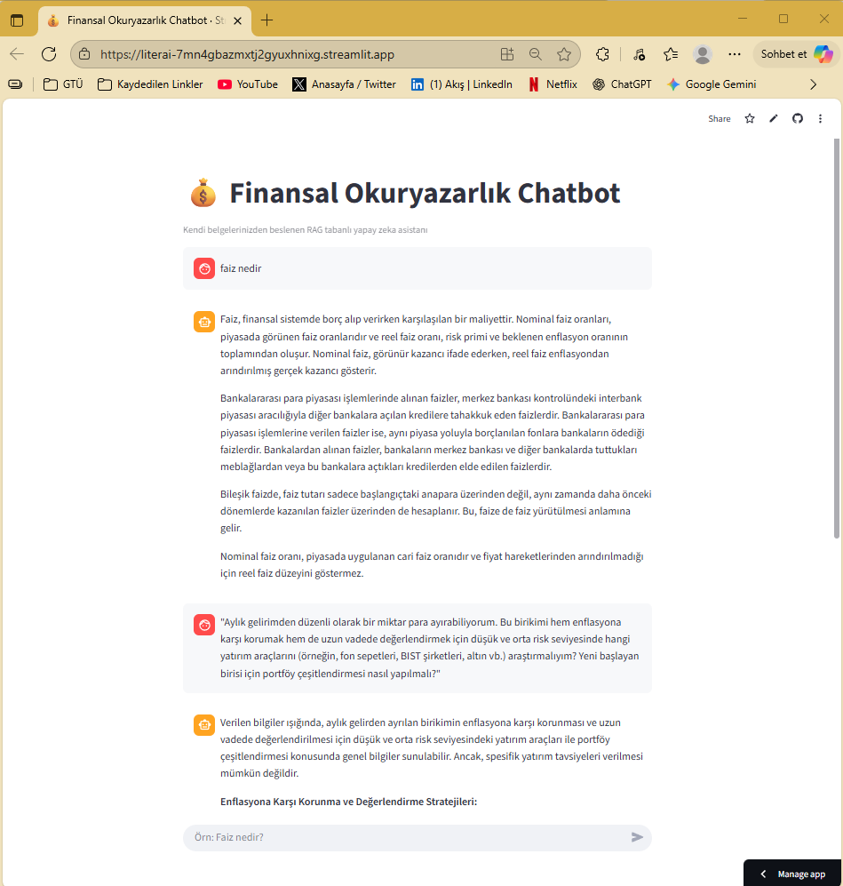

# 💰 Finansal Okuryazarlık Chatbot'u

**Akbank GenAI Bootcamp Projesi ve Amacı**

Bu proje, Akbank GenAI Bootcamp'i kapsamında geliştirilmiş, Retrieval-Augmented Generation (RAG) mimarisiyle çalışan bir finansal okuryazarlık sohbet robotudur. Chatbot, kullanıcı tarafından sağlanan özel bir bilgi havuzundaki (PDF ve Word dokümanları) verileri kullanarak finansla ilgili sorulara cevap vermek üzere tasarlanmıştır. Bu uygulama sayesinde Finansal Okuryazarlık konusunda bilgi birikimini artırmak, güven ve etik kuralları çiğnenmeden, finansal tavsiye vermeden kişiyi tecrübelendirmek amaçlanır. 

## 📚 Veri Seti

Bu projenin bilgi havuzu, finansal okuryazarlık üzerine özenle seçilmiş bir doküman koleksiyonundan oluşmaktadır. Chatbot'a kapsamlı ve güvenilir bir bakış açısı kazandırmak amacıyla, farklı format ve kaynaklardan dokümanlar kullanılmıştır. Bu yaklaşım, modelin hem teorik hem de pratik bilgilere sahip olmasını sağlamıştır.

Kullanılan veri seti aşağıdaki gibi çeşitli kaynakları içermektedir:

* **Resmi Kurum Yayınları:** Türkiye Cumhuriyet Merkez Bankası (TCMB) ve Sermaye Piyasası Kurulu (SPK) gibi kurumların yayınladığı raporlar, sözlükler ve bilgilendirici dokümanlar.
* **Akademik Makaleler:** Kredi, borçlanma ve finansal davranışlar üzerine yazılmış akademik çalışmalar.
* **Finansal Okuryazarlık Kitapçıkları ve Kılavuzlar:** "Personal Finance" ve "Financial Literacy" gibi konularda başlangıç ve orta seviye için hazırlanmış eğitici içerikler.
* **Ekonomi ve Finans Sözlükleri:** Halk Bankası gibi kurumlar tarafından hazırlanan ve genel ekonomi terimlerini açıklayan çeşitli sözlükler.
* **Uzman Sosyal Medya İçerikleri:** Alanında tanınmış ekonomistlerin (örneğin Özgür Demirtaş) finansal konular üzerine yaptığı Youtube programlarının AI kullanılarak dönüştürülen text içerikleri.

Veri seti; kredi, borçlanma, temel ekonomi terimleri, yatırım psikolojisi ve kişisel finans yönetimi gibi temel konuları geniş bir yelpazede kapsamaktadır.

## 🚀 Canlı Uygulama

Uygulamanın canlı versiyonuna aşağıdaki linkten erişebilirsiniz:

**[[Link](https://literai-7mn4gbazmxtj2gyuxhnixg.streamlit.app/)]**

---

## 🛠️ Kullanılan Teknolojiler

* **RAG Framework:** LangChain
* **Web Arayüzü:** Streamlit
* **Embedding Modeli:** `HuggingFaceEmbeddings` (`paraphrase-multilingual-MiniLM-L12-v2`)
* **Üretken Dil Modeli (LLM):** Google Gemini 2.5 Flash Lite(`langchain-google-genai`)
* **Vektör Veritabanı:** FAISS
* **Deployment:** Streamlit Community Cloud

---

## 📁 Proje Yapısı

```
.
├── streamlit_app.py        # Streamlit web arayüzü
├── rag_pipeline.py         # Chatbot'un RAG mantığı
├── vector_store_manager.py   # Vektör veritabanı yönetimi
├── data_processing.py      # Doküman okuma ve işleme
├── requirements.txt        # Python bağımlılıkları
├── data/                   # Veri setini içeren klasör
└── README.md               # Bu dosya
```

---

## 💡 Nasıl Çalışır?

Proje, temel bir RAG akışını takip eder:

1.  **Veri Yükleme ve İşleme:** `data` klasöründeki `.pdf` ve `.docx` dosyaları okunur ve metinler daha küçük parçalara (chunk) bölünür.
2.  **Embedding:** Her bir metin parçası, çok dilli bir embedding modeli kullanılarak anlamsal bir vektöre dönüştürülür.
3.  **Vektör Veritabanı:** Bu vektörler, hızlı arama ve erişim için bir FAISS veritabanında saklanır ve `faiss_index` klasörüne kaydedilir. Bu işlem sadece ilk çalıştırmada veya `faiss_index` klasörü silindiğinde yapılır.
4.  **Sorgulama (Retrieval):** Kullanıcının sorusu da aynı embedding modeliyle vektöre çevrilir ve FAISS veritabanından anlamsal olarak en benzer metin parçaları bulunur.
5.  **Yanıt Üretimi (Generation):** Gemini 2.5 Flash modeli, bulunan bu metin parçalarını "bağlam" olarak kullanarak kullanıcının sorusuna nihai cevabı üretir.

---

## ⚙️ Lokal Kurulum

Bu projeyi kendi bilgisayarınızda çalıştırmak için aşağıdaki adımları izleyebilirsiniz:

1.  **Projeyi Klonlayın:**
    ```bash
    git clone [https://github.com/](https://github.com/)[atakanakdogann]/[LiterAI].git
    cd [LiterAI]
    ```

2.  **Sanal Ortam Oluşturun ve Aktive Edin:**
    ```bash
    python -m venv venv
    # Windows için:
    .\venv\Scripts\activate
    # MacOS/Linux için:
    source venv/bin/activate
    ```

3.  **Gerekli Kütüphaneleri Yükleyin:**
    ```bash
    pip install -r requirements.txt
    ```


4.  **API Anahtarını Ayarlayın:**
    `streamlit_app.py` dosyasını açarak 
    `chatbot = RAGChatbot(api_key=st.secrets["GOOGLE_API_KEY"], vector_store=vector_store)` satırını
    `chatbot = RAGChatbot(api_key="Kendi API Anahtarınız", vector_store=vector_store)` şeklinde değiştirmelisiniz.

5.  **Uygulamayı Çalıştırın:**
    ```bash
    streamlit run streamlit_app.py
    ```
    *Uygulama ilk çalıştırmada `faiss_index`'i otomatik olarak oluşturacaktır. Bu işlem biraz zaman alabilir.*

---

## 📊 Elde Edilen Sonuçlar

Geliştirilen chatbot, kendisine sağlanan bilgi havuzu dahilinde tutarlı ve başarılı cevaplar üretmektedir. Modelin performansı, sorunun niteliğine göre farklılık göstermektedir:

1. Bilgiye Dayalı Sorulardaki Başarısı: Chatbot, "faiz nedir?" gibi net ve tanımlayıcı sorularda oldukça başarılıdır. Veri setindeki farklı dokümanlardan aldığı bilgileri etkili bir şekilde sentezleyerek; nominal faiz, reel faiz, risk primleri ve bileşik faiz gibi kavramları içeren kapsamlı ve doğru bir özet sunabilmektedir.

2. Karmaşık ve Yoruma Dayalı Sorulardaki Performansı: "Yeni başlayan birisi için portföy çeşitlendirmesi nasıl yapılmalı?" gibi daha karmaşık ve tavsiye niteliği taşıyan sorularda ise chatbot'un RAG mimarisine dayalı sınırları net bir şekilde görülmektedir. Bu tür bir soruyla karşılaştığında chatbot:

Doğrudan finansal tavsiye vermekten kaçınarak güvenli bir çerçevede kalmıştır.

Veri setinde geçen ilgili yatırım araçlarını (altın, hisse senetleri, borçlanma araçları vb.) başarılı bir şekilde tespit edip listeleyebilmiştir.

Ancak, veri setinde "yeni başlayanlar için adım adım portföy oluşturma" gibi spesifik bir strateji bulunmadığı için, bu konuda doğrudan bir yol haritası sunamamış ve bu eksikliği dürüstçe belirtmiştir.

## 🖥️ Web Arayüzü ve Product Kılavuzu

Uygulamanın web arayüzü oldukça basittir. Sayfa açıldığında, en altta bulunan metin kutusuna finansla ilgili sorunuzu yazıp Enter'a basmanız yeterlidir.

**Örnek Ekran Görüntüsü:**



Asistan, sorunuza veri setindeki bilgilere dayanarak cevap verecektir. Sohbet geçmişiniz sayfa yenilenmediği sürece ekranda kalacaktır.